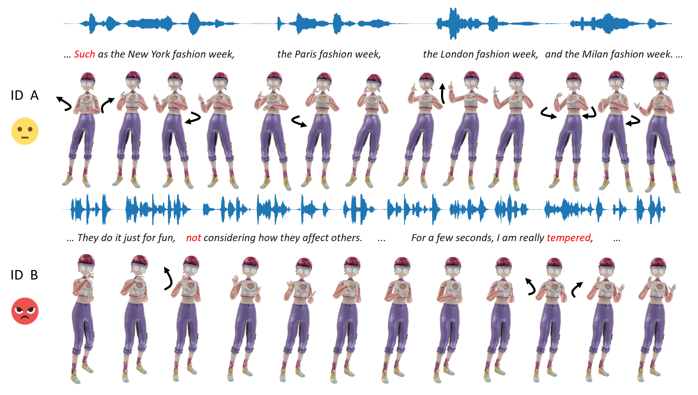

# MMoFusion: Multi-modal Co-Speech Motion Generation with Diffusion Model

[](https://arxiv.org/abs/2403.02905)

The official PyTorch implementation of the paper [**"MMoFusion: Multi-modal Co-Speech Motion Generation with Diffusion Model"**](https://arxiv.org/abs/2403.02905).

Please visit our [**webpage**](https://mmofusion.github.io/) for more details.

<div align=center>

</div>

## News

📢 **17/Jun/24** - First release - pretrained models, train and test code.

## Todo list
1. Custom Speech Tutorial
2. Train autoencoder for FGD 

## 1. Setup environment
```shell
conda create -n mmofusion python=3.7
pip install torch==1.10.1+cu111 torchvision==0.11.2+cu111 torchaudio==0.10.1 -f https://download.pytorch.org/whl/cu111/torch_stable.html
pip install -r requirements.txt
```
## 2. Data preparation
Download the [BEAT](https://github.com/PantoMatrix/PantoMatrix/blob/main/scripts/BEAT_2022/readme_beat.md) datasets, choose the [English data v0.2.1](https://drive.google.com/file/d/1Akf0WgAwuH2fvlWbvNpif4XRqXlpznh9/view).

We preprocess the data based on the [DiffuseStyleGesture](https://github.com/YoungSeng/DiffuseStyleGesture), thanks for their great work!

Download the audio prepocess model [WavLM-Large](https://github.com/microsoft/unilm/tree/master/wavlm) and text prepocess model [crawl-300d-2M](https://dl.fbaipublicfiles.com/fasttext/vectors-english/crawl-300d-2M.vec.zip).

```shell
cd ./process/

python process_BEAT_bvh.py /your/BEAT/path/ /path/to/BEAT/processed/ None None "v0" "step1" "cuda:0"

python process_BEAT_bvh.py /your/BEAT/path/ /path/to/BEAT/processed/ "/your/weights/WavLM-Large.pt" "/your/weights/crawl-300d-2M.vec" "v0" "step3" "cuda:0"
```
The processed data will be saved in `/path/to/BEAT/processed/`, before converting it into H5file, you can split the data into train/val/test as our setting by the script `data_split_30.ipynb`. After that, you will get the H5file `BEAT_v0_train.h5` by running:

```shell
python process_BEAT_bvh.py /your/BEAT/path/ /path/to/BEAT/processed/ None None "v0" "step4" "cuda:0"
```
and get the mean, std in `./process/` by running:
```shell
python calculate_gesture_statistics.py --dataset BEAT --version "v0"
```
## 3. Test
Download our pretrained [models](https://drive.google.com/drive/folders/1-XyiBgL-oWmv9mTi4AlTw2M_BbGgUJTR) including motion generation with upper body and whole body.

You can also find the pretrained autoencoder model `last_600000.bin`, which we trained it on 30 speakers data.

Edit the `model_path` and `e_path` to load the pretrained models for test, and `tst_path` to load the processed test data.
```shell
for upper body
python sample_linear.py --config=./configs/mmofusion.yml --gpu 0

for whole body
python sample_linear.py --config=./configs/mmofusion_whole.yml --gpu 0
```

You can also modify the weight `guidance_param` since we use the classifier-free guidance during training.

## 4. Train
Edit the `h5file` in the config to load the H5file `BEAT_v0_train.h5`.
```shell
for upper body
python train.py --config=./configs/mmofusion.yml --gpu 0

for whole body 
...
```

## Citation
If you find this repo useful for your research, please consider citing our paper:
```
@misc{wang2024mmofusion,
      title={MMoFusion: Multi-modal Co-Speech Motion Generation with Diffusion Model}, 
      author={Sen Wang and Jiangning Zhang and Weijian Cao and Xiaobin Hu and Moran Li and Xiaozhong Ji and Xin Tan and Mengtian Li and Zhifeng Xie and Chengjie Wang and Lizhuang Ma},
      year={2024},
      eprint={2403.02905},
      archivePrefix={arXiv},
      primaryClass={id='cs.MM' full_name='Multimedia' is_active=True alt_name=None in_archive='cs' is_general=False description='Roughly includes material in ACM Subject Class H.5.1.'}
}
```

